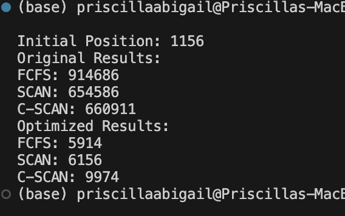

### Priscilla Abigail 2602109883

#### To run: 
```
python disk_scheduler.py requests.txt
```

#### Result:



#### The 3 Algorithms used: 

- FCFS Algorithm: FIFO - whichever process enters process enters the ready queue first is executed first.

- Scan (Elevartor) Algorithm: moves the disk head back and forth across the disk to service requests sequentially, giving priority to midrange requests and causing those behind the disk arm to wait.
 
- C-Scan Algorithm: a modified version of the SCAN algorithm, moves the disk head from one end to the other servicing requests and then quickly returns to the start without servicing any requests, ensuring uniform request servicing and is known as the “Circular Elevator Algorithm.”

